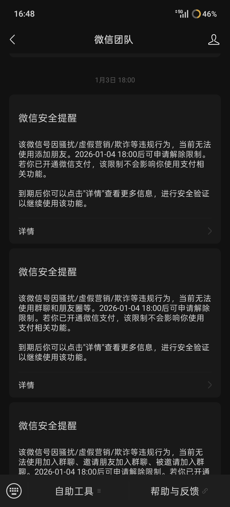

# 关于传播套壳Web的一些经验
## 微信传播
### 特殊风险：微信被封
可能的触发条件(做出下面的一些操作可能会触发)：通过微信支付与多人小额收账 + 在微信发布链接 / 软件 (综合所致，概率触发)
限制：无法加好友，无法在群聊中发言。可能有好友会被打电话警告不要转账注意刷单，且弹出警告提示。
解决：到时间后，需要好友用身份证解封

### 传播困难点
在微信中传播安卓软件，软件的后缀会被更改，导致无法自动触发安装，需要用户手动找到文件点击安装
## 商店传播
优点：能正式上架的话，不会被手机检测为病毒
缺点：应用商店上架需要一定比例与深度的原生，而纯粹的web套壳实际是被排斥的。比较麻烦，适合本身是从事软件开发的人做
## 网址传播
优点：无需上架，无需原生，点击后直接浏览器触发安装
缺点：无法解决被检测为病毒的问题
## 学校传播
注意: 如果没解决病毒检测的认证问题，可能会被举报，可能会要求商店传播。如果使用微信传播，微信的限制会容易让人产生怀疑且操作门槛较高
如果使用网址传播的话，则情况要好很多。传播过程中，使用微信的个人账号传播不推荐，容易被举报“诈骗”，但是在可以打广告的大群或以一个身份比较权威的人来传播
则会好很多。总之处于某种灰色地带